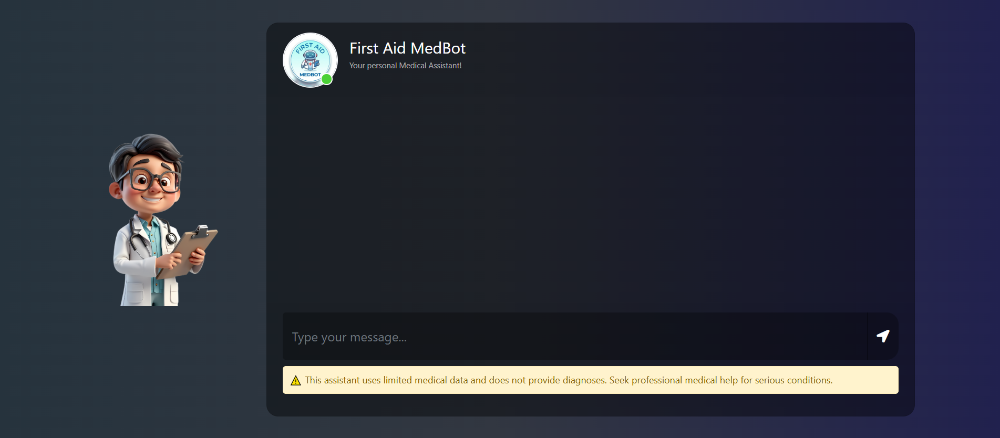
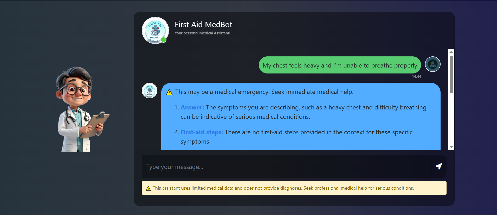

# 🩺 First Aid MedBot

An AI-powered **First Aid Assistant** built using Retrieval-Augmented Generation (RAG) to provide **quick, context-aware medical guidance during emergencies**.

> ⚠️ **Disclaimer:** This bot provides first-aid suggestions based only on the available dataset. It is **NOT a replacement for professional medical advice**. Always consult a doctor for serious conditions.

---

## 🚀 Features

- 🧠 RAG-based medical chatbot
- ⚡ Emergency triage classification (Emergency / Urgent / Normal)
- 📚 Context-aware responses using vector database
- 🔍 MMR-based intelligent retrieval
- 🛡️ Safety guardrails (no false guarantees or unsafe advice)
- 💬 Simple Flask-based UI

---

## 🖼️ Interface



---

## ⚙️ How It Works



---

## 🏗️ Tech Stack

- **Backend:** Python  
- **Frontend:** Flask  
- **LLM API:** Gemini API  
- **Framework:** LangChain  
- **Vector DB:** Pinecone  
- **Embeddings:** HuggingFace (`sentence-transformers/all-MiniLM-L6-v2`)  
- **Deployment:** AWS CI/CD  

---

## 📊 System Architecture

### 1. Data Ingestion
- Extracted data from PDFs using `PyPDFLoader`
- Filtered relevant fields: **source** and **content**

### 2. Text Processing
- Chunk size: `500`
- Chunk overlap: `20`

### 3. Embedding
- Model: `all-MiniLM-L6-v2`
- Dimension: `384`

### 4. Vector Storage
- Pinecone vector database
- Metric: `cosine`
- Serverless (AWS)

### 5. Retrieval
- Search Type: **MMR**
- Parameters:
  - `k = 4`
  - `fetch_k = 10`

### 6. LLM Pipeline
```python
qa_chain = create_stuff_documents_chain(model, prompt)
rag_chain = create_retrieval_chain(retriever, qa_chain)
```
- Triage prompt → classifies emergency level
- System prompt → generates final answer with context

###  7. Safety Layer
- Prevents:
  - Medical guarantees
  - 100% cure claims
  - Unsafe or misleading advice
 
## 🛠️ Setup Instructions

### STEP 1: Clone Repository
```
git clone <your-repo-url>
cd <your-project-folder>
```
### STEP 2: Create Virtual Environment

```
python -m venv .venv
.venv\Scripts\activate
```
### STEP 3: Install Dependencies
```
pip install -r requirements.txt
```
### STEP 4: Add Environment Variables

Create a .env file:
```
GEMINI_API_KEY=your_api_key
PINECONE_API_KEY=your_api_key
```
### ▶️ Run the Application

```
python app.py
```
Open in browser:

```
http://localhost:5000
```


## ☁️ AWS CI/CD Deployment (Optional)
- Create IAM user with:
  - EC2 access
  - ECR access
- Build & push Docker image to ECR
- Launch EC2 instance
- Pull image and run container
- Configure GitHub Actions with secrets:
  - AWS_ACCESS_KEY_ID
  - AWS_SECRET_ACCESS_KEY
  - AWS_DEFAULT_REGION
  - ECR_REPO
  - PINECONE_API_KEY
  - GEMINI_API_KEY

## 📌 Key Design Decisions
- Used MMR retrieval for better diversity in results
- Limited response length for emergency usability
- Added triage classification for urgency handling
- Implemented guardrails for safe medical responses

## 🙏 Acknowledgement

This project is inspired by and built upon learnings from various open-source resources, tutorials, and the AI community.
Thanking Bappy Ahmed for guiding through the video lecture on youtube.
Special thanks to contributors and platforms that made tools like LangChain, Pinecone, and modern LLM APIs accessible for building real-world applications.